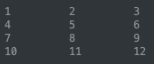
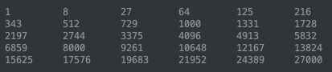

# Project TTEXP
Create and print a 2D Times Tables with variables Rows, Cols with Exponent

* For instance you could create a 3x4 times table with exponent 1 like so:

     

* A 5x6 times table with exponent 3 would look like this:

    

## Tasks

1. Create a public class TTE in a separate java tab
    1. Add one method ```public static ttexp()``` that takes in 3 int parameters ```rows_, cols_, exp_```
    1. create and return a 2D array from this method with values like the ones shown above
    1. Use 2 ```nested for loops``` to do this.
1. Create a main tab in processing with name times_tables
    1. Create int global variables ```rows, cols, exp``` and assign some initial values.
    1. Create a 2D array named ```tt``` of type ```long```. Do not initialize it here! 
    1. In ```setup()``` call the static method ```ttexp()``` in class ```TTE``` and assign the returned value to ```tt``.
    1. Write a function ```print_ttexp()```. Inside this function, use two ```enhanced nested for loops``` to print the resulting times tables as shown above.
1. Test with various values of rows, cols, and exponent.

## Grading Rubric
Grades will be assigned for 2 categories equally weighted:
1. Following the instructions above STRICTLY!!
1. Correct numerical results for various rows, cols, exponent as shown above
1. Code should be written following proper coding standards and best practices, Results should be properly formatted.
